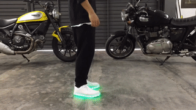
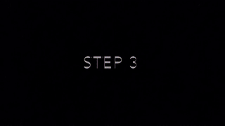

Shuffle steps are usually split each tempo into two phases, songs usually follow
a 4/4 structure. To differentiate the steps between tempos I'm going to use the
tempo number they come from followed by an `-and` so the structure will be:
`8-and`, `1`, `1-and`, `2`... Where the `1` is the phrase starter.

Most of the steps don't have names so I've put one that felt it fits.

To specify the relative position of body parts, I'm using an imaginary clock, so
12 means upfront, 3 our right, 6 our back and 9 our left.

# Running man

* *8-and*: Both legs straight under our body, right leg lifted up
    with knee up front. Weight lies on the left foot.
* *1*: Right foot kicks forward, left foot slides backward, in a way that each travel the
    same distance. Weight is evenly shared between the feet.
* *1-and*: Right foot slides backwards, right foot goes up, knee to the front.
    Weight lies on the right foot.
* *2*: Mirrors *1*.
* *2-and*: Mirrors *1-and* and it's equal to *8-and*.

Sources: [1](https://www.youtube.com/embed/LbeRR_TDRVE?start=54), [2](https://www.youtube.com/embed/NVISfLc_z8c?start=18)

The foot going forward can land in the floor flat, heel first or toes first.

## Kicking-Running man

* *8-and*: Both legs straight under our body, right leg lifted up
    with knee up front. Weight lies on the left foot.
* *1*: Right foot kicks forward without touching the ground, it's important that
    the kick is clean, so swift till the end and stop suddenly. At the same time
    the left foot has slided back a little bit.
* *1-and*: Right foot is retrieved, knee up and foot parallel to the ground,
    left foot keeps on sliding back.
* *2*: Right foot hits the ground, left foot keeps on sliding, weight is evenly
    shared between feets like the *1* of the running man.

Sources: [1](https://www.youtube.com/watch?v=rOQa0gXan70?start=13)

# T-Shape

## Kicking T-Shape

* *8-and*: Both legs straight under our body, right leg lifted up
    with knee up front. Weight lies on the left foot.
* *1*: Right foot kicks sideways towards 3, try to leave the feet at 90 degrees
    with your leg and that it doesn't wobble, so it's a clean kick. The weight
    is on the left leg's toes and it pivotes over them till it points to 10.5.
    Waist ends up turned.
* *1-and*: Right foot is retrieved till the left leg's knee, keeping the base
    parallel to the ground. Weight is on the left's leg heels and pivotes over
    them to reach the 1.5 position. Waist is straight now.
* *2*: Equal to *1*.
* *2-and*: Equal to *1-and*.
* *3*: Equal to *1*.
* *3-and*: Equal to *1-and*.
* *4*: Right foot crosses before the left one, toes touch the floor first in our
    longitudinal axes. The left foot pivots over the toes to end up pointing to
    our 11. Weight is evenly shared between the feet toes.
* *4-and*: Mirrors *8-and*.
* *5*: Mirrors *1*.
* *5-and*: Mirrors *1-and*.
* *6*: Mirrors *1*.
* *6-and*: Mirrors *1-and*.
* *7*: Mirrors *1*.
* *7-and*: Mirrors *1-and*.
* *8*: Mirrors *4*.

Sources: [1](https://www.youtube.com/embed/NVISfLc_z8c?start=88)

# Tap spin

* *8*: Feet at the end of a running man, we generate a slight upper body twist
    clockwise to load the twist.
* *8-and*: Left foot goes back to the body axes and the right foot goes to the
    body with knee up like a running man, with the difference that we release
    the twist energy and we start turning counterclockwise. Weight is on the
    left foot toes and it's knee is a little bit bent.
* *1*: Right foot kicks sideways towards 3 touching the ground but not putting
    any weight into it while we unbend the left knee taking the chance to keep
    the spin going.
* *1-and*: Right foot goes back to the body and left knee is again a little bit
    bent waiting for the next kick.
* *2*: Equal to *1*
* *2-and*: Equal to *1-and*
* *3*: Becomes the *1* of the running man.

You can spin as long as you want, I've explained a two times spin, but if you
want to go further repeat *1* and *1-and* as long as you want.

Sources: [1](https://www.youtube.com/watch?v=rOQa0gXan70?start=50)

# Basic crossing

* *8-and*: Left legs straight under our body, with the weight in the toes and
    the foot a little turned with the heel pointing to our right (7 o'clock),
    right leg lifted up straight to our 3 o'clock with toes pointing down.
    with knee up front. Weight lies on the left foot.
* *1*: Right foot crosses before the left one, toes touch the floor first in our
    longitudinal axes. The left foot pivots over the toes to end up pointing to
    our 11. Weight is evenly shared between the feet toes.
* *1-and*: Mirrors *8-and*.
* *2*: Mirrors *1*.
* *2-and*: Equal to *8-and*.

Sources: [1](https://www.youtube.com/embed/NVISfLc_z8c?start=41)

# Wiggle feet

* *8-and*: Both legs straight under our body, right leg lifted up
    with knee up front. Weight lies on the left foot.
* *1*: Right foot touches the floor behind the hips pointing to 10.5, left foot
    pivots over the toes to point to 1.5. Weight is even between feet.
* *1-and*: Right foot pivots on the heel till 1.5. Left foot pivots on the toes
    till 10.5.
* *2*: Equal *1*.
* *2-and*: Mirrors *1-and*.
* *3*: Equal *1*.
* *3-and*: Equal *1-and*.
* *4*: Equal *1*.

Sources: [1](https://www.youtube.com/embed/NVISfLc_z8c?start=119)

# References

## Where to discover more tutorials

* [Elements tutorial playlist](https://www.youtube.com/playlist?list=PLv695483ty5Nj0L0ZsAIiSAN62-lT6-3U)
* [Anderson Jovani playlist](https://www.youtube.com/playlist?list=PLPAWfysb_wUx259mARAAWuYttD7b6nauh)
